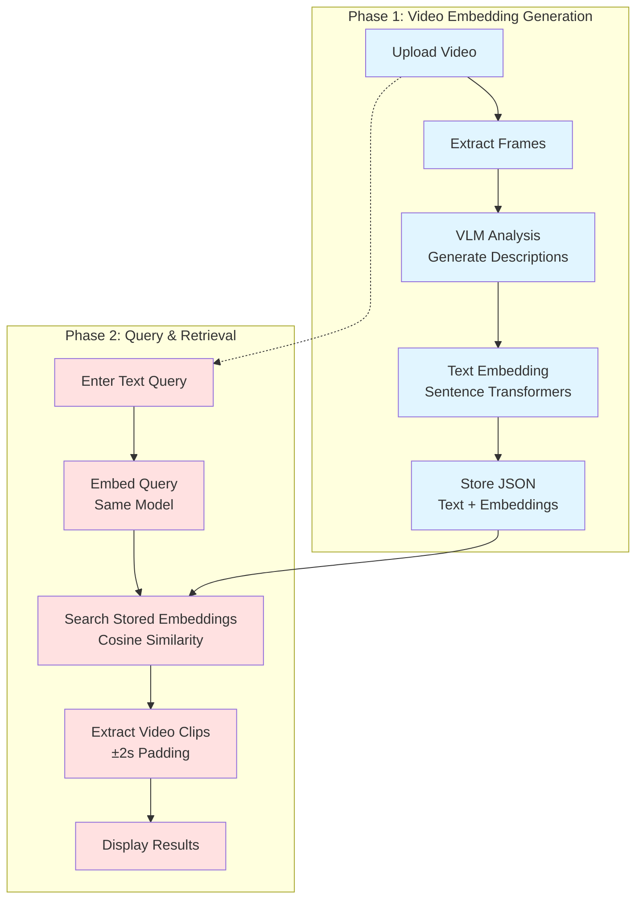
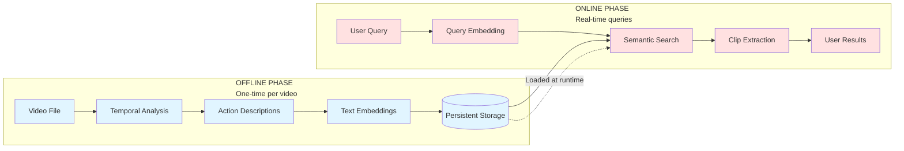
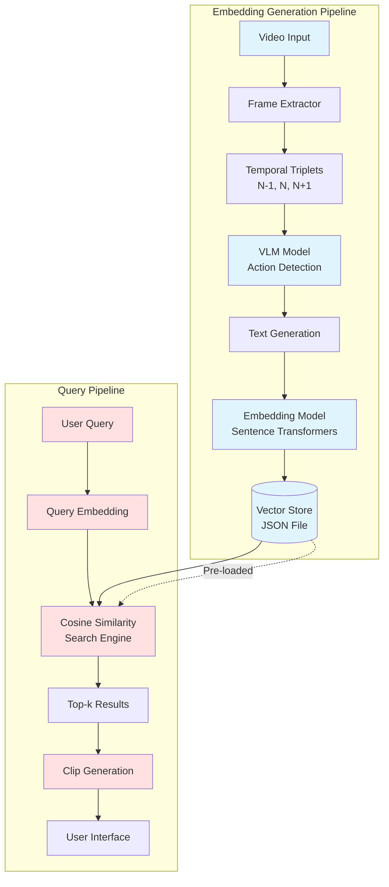
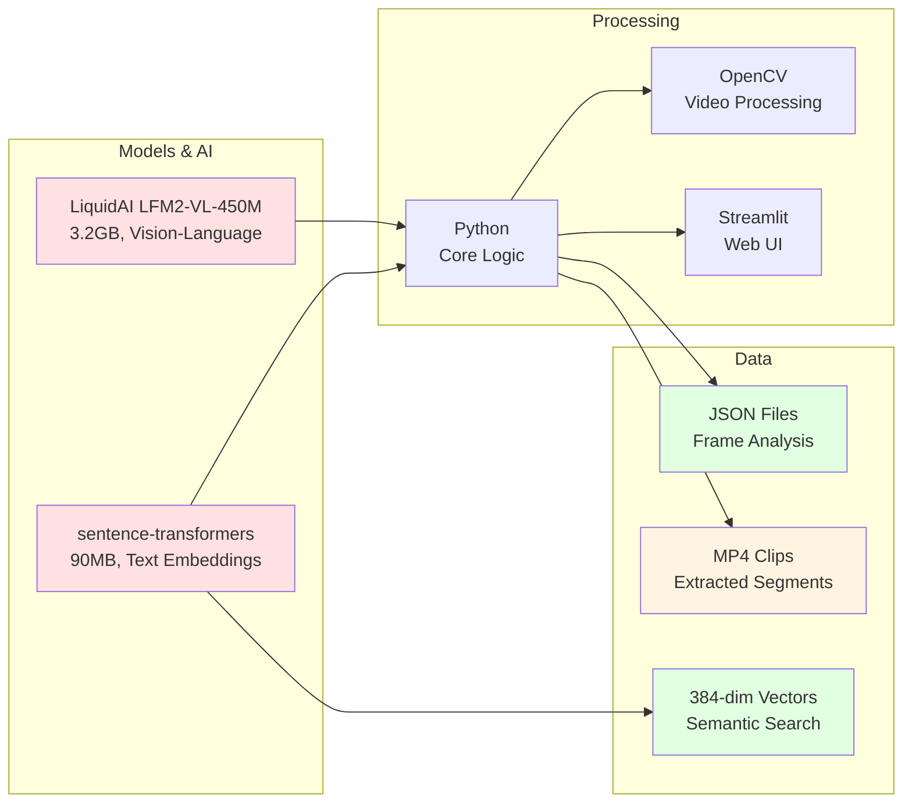
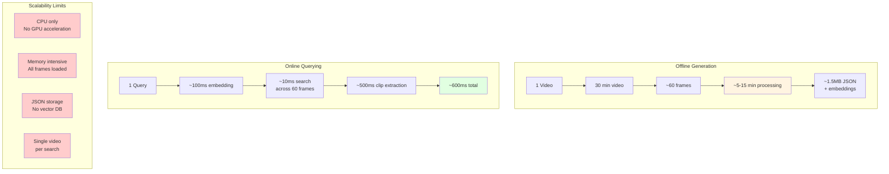
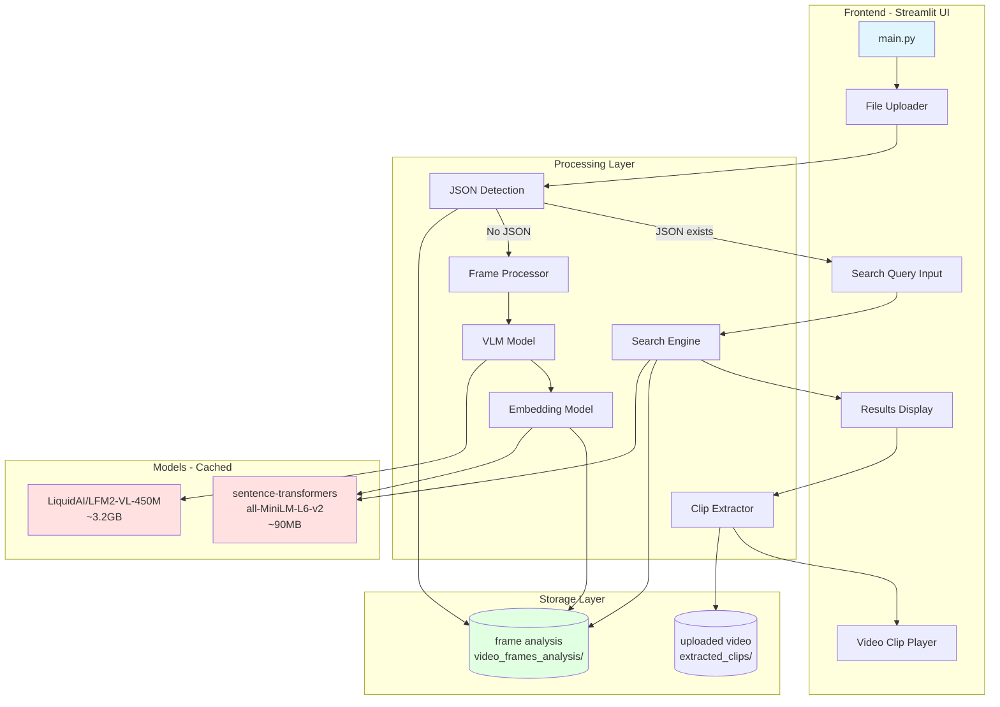
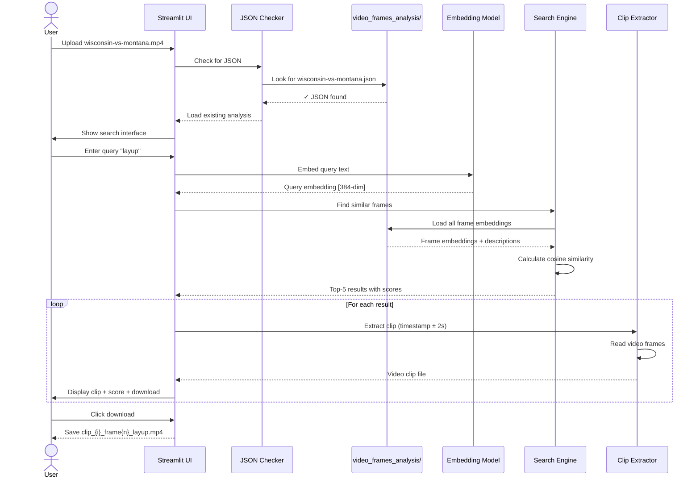

# Semantic Video Search - System Workflow

## High-Level Architecture



## Two-Phase Architecture Overview



## Component Architecture



## Data Flow Between Phases

```mermaid
flowchart TD
    subgraph "Phase 1: Offline Processing"
        VideoIn[Input Video<br/>.mp4/.mov] --> Process[Batch Processing<br/>5-15 sec/frame]
        Process --> Analysis[Temporal Analysis<br/>+15/-15 frame window]
        Analysis --> Description[Action Description<br/>"person jumping to shoot"]
        Description --> Vector[384-dim Vector<br/>Semantic Embedding]
        Vector --> Persist[(JSON Storage<br/>video_name.json)]
    end

    subgraph "Phase 2: Online Querying"
        TextInput[Text Query<br/>"layup"] --> Encode[Encode Query<br/>Same Model]
        Persist --> Load[Load Embeddings<br/>All Frames]
        Encode --> Compare[Compare Vectors<br/>Cosine Similarity]
        Load --> Compare
        Compare --> Rank[Rank Results<br/>By Similarity]
        Rank --> Extract[Extract Clips<br/>±2s padding]
        Extract --> Show[Display with Scores<br/>0.8745, 0.7231, ...]
    end

    Persist -.->|Shared Data| Load

    style VideoIn fill:#e1f5ff
    style Process fill:#e1f5ff
    style Analysis fill:#e1f5ff
    style Description fill:#e1f5ff
    style Vector fill:#e1f5ff
    style Persist fill:#e1f5ff
    style TextInput fill:#ffe1e1
    style Encode fill:#ffe1e1
    style Compare fill:#ffe1e1
    style Show fill:#ffe1e1
```

## Technology Stack



## Performance & Scalability



## Complete System Diagram

```mermaid
flowchart TD
    Start([User runs streamlit run main.py]) --> Upload[Upload Video File]
    Upload --> CheckJSON{JSON exists for<br/>this video?}

    CheckJSON -->|Yes| LoadJSON[Load existing JSON analysis]
    CheckJSON -->|No| Analyze[Start Video Analysis]

    LoadJSON --> ShowResults[Display frame count & results]
    ShowResults --> SearchUI[Show Search Interface]

    Analyze --> LoadModels[Load VLM & Embedding Models]
    LoadModels --> ExtractFrames[Extract All Frames to Memory]
    ExtractFrames --> CreateTriplets[Create Temporal Frame Triplets<br/>Before/Current/After]
    CreateTriplets --> BatchProcess[Process Batches Sequentially]

    BatchProcess --> VLMDesc[VLM generates action descriptions<br/>for each frame triplet]
    VLMDesc --> EmbedText[Embed descriptions using<br/>sentence-transformers]
    EmbedText --> SaveIncremental{Processed 8<br/>frames?}

    SaveIncremental -->|Yes| SaveJSON[Save checkpoint JSON<br/>status: in_progress]
    SaveIncremental -->|No| MoreBatches{More<br/>batches?}
    SaveJSON --> MoreBatches

    MoreBatches -->|Yes| BatchProcess
    MoreBatches -->|No| SaveFinal[Save final JSON<br/>status: complete]
    SaveFinal --> SearchUI

    SearchUI --> QueryInput[Enter search query<br/>e.g., 'layup']
    QueryInput --> EmbedQuery[Embed query text using<br/>same embedding model]
    EmbedQuery --> CosineSim[Calculate cosine similarity<br/>between query & all frame embeddings]
    CosineSim --> TopK[Return top-k results<br/>sorted by similarity]

    TopK --> DisplayResults[For each result...]
    DisplayResults --> CalcTimestamp[Calculate frame timestamp<br/>from frame number & FPS]
    CalcTimestamp --> ExtractClip[Extract video clip with<br/>±2s padding]
    ExtractClip --> ShowClip[Display clip & similarity score]
    ShowClip --> Download[Download button for clip]
    Download --> NextResult{More<br/>results?}

    NextResult -->|Yes| DisplayResults
    NextResult -->|No| Done([User can query again or<br/>re-analyze video])

    style Start fill:#e1f5ff
    style Done fill:#e1f5ff
    style SearchUI fill:#ffe1e1
    style SaveFinal fill:#e1ffe1
    style LoadJSON fill:#fff4e1
```



## Data Flow Diagram

```mermaid
flowchart LR
    Video[(Video File<br/>wisconsin-vs-montana.mp4)] --> FrameExtract[Frame Extraction]
    FrameExtract --> Frames[(All Video Frames<br/>in Memory)]

    Frames --> Sample[Sample every 30 frames]
    Sample --> Triplets[(Frame Triplets<br/>N-1, N, N+1)]

    Triplets --> VLM[VLM Model<br/>LFM2-VL-450M]
    VLM --> Descriptions[(Text Descriptions<br/>person jumping to shoot)]

    Descriptions --> Embedder[Sentence Transformer<br/>all-MiniLM-L6-v2]
    Embedder --> Embeddings[(384-dim Vectors)]

    Descriptions --> JSON[(JSON File<br/>wisconsin-vs-montana.json)]
    Embeddings --> JSON

    JSON --> Search[Search Function]
    Query[(User Query<br/>layup)] --> QueryEmbed[Embed Query]
    QueryEmbed --> Search

    Search --> Similarity[Cosine Similarity]
    Similarity --> Results[(Top-k Results<br/>with scores)]

    Results --> ClipExtract[Clip Extractor]
    Video --> ClipExtract
    ClipExtract --> Clips[(Video Clips<br/>±2s padding)]

    style Video fill:#e1f5ff
    style JSON fill:#e1ffe1
    style Query fill:#ffe1e1
    style Clips fill:#fff4e1
```



## Architecture Diagram



## Sequence Diagram - Search Flow



## File Structure Diagram

```mermaid
graph TD
    Root[lf2-vl-video-search/] --> App[app.py<br/>Basic upload UI]
    Root --> Main[main.py<br/>Main application<br/>3200+ lines]
    Root --> Search[search.py<br/>CLI search tool]
    Root --> Claude[CLAUDE.md<br/>Documentation]
    Root --> Req[requirements.txt]

    Root --> UploadsDir[uploads/]
    Root --> AnalysisDir[video_frames_analysis/]
    Root --> ClipsDir[extracted_clips/]

    AnalysisDir --> JSON1[wisconsin-vs-montana-clip.json]
    AnalysisDir --> JSON2[video_analysis1.json]

    ClipsDir --> Clip1[clip_1_frame15_layup.mp4]
    ClipsDir --> Clip2[clip_2_frame28_layup.mp4]
    ClipsDir --> TempVid[temp_wisconsin-vs-montana-clip.mp4]

    JSON1 --> Structure{JSON Structure}
    Structure --> VidName[video_name: str]
    Structure --> TotalFrames[total_frames: int]
    Structure --> Status[status: complete/in_progress]
    Structure --> FramesList[frames: Array]

    FramesList --> Frame{Frame Object}
    Frame --> FrameNum[frame_number: int]
    Frame --> Text[text: str<br/>action description]
    Frame --> Embedding[embedding: float[]<br/>384 dimensions]

    style Main fill:#e1f5ff
    style AnalysisDir fill:#e1ffe1
    style ClipsDir fill:#fff4e1
    style JSON1 fill:#ffe1e1
```

## Model Processing Pipeline

```mermaid
flowchart LR
    subgraph Input
        V[Video Frame N-1]
        C[Video Frame N]
        A[Video Frame N+1]
    end

    subgraph "VLM Processing"
        Conv[Multi-image<br/>Conversation Template]
        VLM[LiquidAI LFM2-VL-450M<br/>Image-Text-to-Text]
        Gen[Generate Description<br/>max 128 tokens]
    end

    subgraph "Embedding Generation"
        Desc[Text Description<br/>person jumping to shoot]
        Embed[Sentence Transformer<br/>all-MiniLM-L6-v2]
        Vec[384-dim Vector<br/>[0.123, -0.456, ...]]
    end

    subgraph Output
        JSON[JSON Entry:<br/>frame_number, text, embedding]
    end

    V --> Conv
    C --> Conv
    A --> Conv
    Conv --> VLM
    VLM --> Gen
    Gen --> Desc
    Desc --> Embed
    Embed --> Vec

    Desc --> JSON
    Vec --> JSON

    style Input fill:#e1f5ff
    style VLM fill:#ffe1e1
    style Embed fill:#ffe1e1
    style Output fill:#e1ffe1
```

